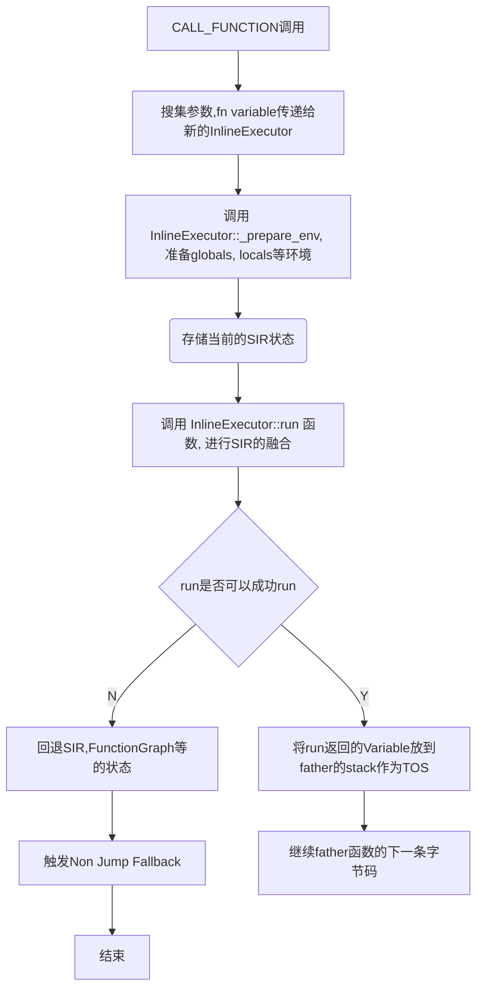

## CallFunction 支持

### 两个选择

1. 使用自己模拟的 Frame 构建， Frame 传参等操作。

2. 使用 Eval Frame 的机制，但是构造不同的 eval frame 函数。

优缺点对比：

| 两个CallFunction方案对比 |           优点           |                                     缺点                                    |
|       -------------      |       -------------      |                                   -------                                   |
|         模拟Frame        |       完全自己控制       |  1. 得自己处理Globals、Locals等逻辑<br>2. 完备性无法保证，魔法函数难以追踪  |
|       复用EvalFrame      | 不用处理调用前的准备细节 | 完备性、依赖eval frame的3个模式的完备性                                   N |

两个都依赖的：

1. 他们都需要区分 `组网模式` 和 `内部callback模式` 的区别。


### 尝试：直接复用Python的函数调用: Frame准备逻辑

可以直接复用 Frame 的准备逻辑，这个逻辑如果复用，那么我们直接在 OpExecutor 过程中 运行 call function 即可。

1. call function 的话，什么时候 func 进行融合，什么时候不进行融合 ?

### 总结：三种 Eval Frame 方案

|      方案类别      |    模拟执行   | 真实执行 |
|    -------------   | ------------- |  ------- |
|      组网模式      |       Y       |     Y    |
|  内部CallFunction  |       Y       |     N    |
| 动态图fallback模式 |       N       |     Y    |


### 问题：复用EvalFrame方案是否会有调用问题 ?

希望在模拟时直接调用 call function 函数，闭包、globals 等是否会有问题。

```python
def func():
    bar()
```

这里的 bar 的 globals 如果和 func 不一样，我们在 eval frame 里面对 bar 进行了调用，是否一定和原来代码执行相同？


### 似乎 eval frame 方案是没问题的

任务拆分 -- 代码实现一波：

1. eval frame 模式 2 的准备和开发 。

2. call function 时进行 return value 的区分 。

3. opcode executor 的分类，子类方式来重载某些字节码的实现。比如 return value，组网行为。

4. eval frame 如何获取当前是初始frame，还是sub frame，如何给上层的 frame 返回值捏

5. SIR 组网阶段是分开组网还是同用同一个？

### SIR 如何实现 fallback 时回退？对FunctionGraph Copy 一份？


## 竞品调研

### Dynamo 选择了『Frame 模拟操作』

1. Dynamo 会将每个 function type 包装为 SkipFileVariable 或者是 UserFunctionVariable

2. 如果是一个用户的函数，那么会进行 inline 的链接。即使用了*模拟Frame的调用方式*。
``` python
def inline_user_function_return(self, fn, args, kwargs):
    """
    A call to some user defined function by inlining it.
    """
    state = self.copy_graphstate()
    try:
        result = InliningInstructionTranslator.inline_call(self, fn, args, kwargs)
        self.output.guards.update(fn.guards)
        return result
    except Exception:
        self.restore_graphstate(state)
        raise
```
可以看到上述代码也是进行了Graph的恢复行为，这个其实和我想的差不多。

3. 如果中间出现了任何的异常，都会触发当前 Graph 的独立成组。将每个 Function 当做是一个 sub graph 来进行调用。


### 需要考虑的：

1. code 可以是一个 generator 类型

2. 传参等操作可以很好的处理吗？globals准备、locals 的准备、闭包的准备。

### Call Function 的参数传递 ：Frame 的准备

好像也不复杂。


## 版本适配工作

CPython 中对 code 的实现有如下的代码：


## PaddleSOT 实现

目前 PaddleSOT 也是使用 inline call 的方式来实现的。因为 eval frame 的实现参数传递比较复杂。而模拟只需要处理前面和后面的参数传递部分即可。

在 paddle 的实现中，一共有多个组件来实现 inline call 的子图融合，主要包含下面几个部分：

- InlineExecutor: 包含字节码差异行为的实现

- FunctionGlobalTracker 的引入

- Function graph 回滚机制

- Bytecode Force Fallback 机制

### InlineCallExecutor

在原来的 OpcodeExecutor的基础上引入了inline call的executor，专门用来对子函数的SIR进行融合。主要的算法流图如下：

如果 father 调用了 child 函数，那么会有如下的流程图：




##### 部分指令的区别

InlineCallExecutor 与 OpcodeExecutor 存在某些指令上的区别。目前是通过类继承重写来实现的差异表示，当前已知的差异有如下几点。

|  ByteCodeName | OpcodeExecutor | InlineCallExecutor |
| ------------- |  ------------- |       -------      |
|  RETURN_VALUE |        Y       |          N         |
| JUMP fallback |        Y       |          N         |


### FunctionGlobalTracker (Motivation)

这个Case可以比较好的让大家理解 Tracker 的主要机制，什么时候需要引入新的 Tracker等。


### Function graph 回滚机制 (Motivation)

### Bytecode Force Fallback (Motivation)


## Tasks and Todos

- [x] InlineExecutor

    - [x] RETURN_VALUE 区别：组网返回 vs 值返回

    - [x] 出现子图fallback情况： fallback vs SIR回滚


- [x] prepare_env 函数的实现

    - [x] globals, locals, const

    - [ ] 闭包支持


- [x] 额外的 Tracker

    - [x] FunctionGlobalTracker


- [ ] SIR save_memo 机制和 restore_memo 机制
